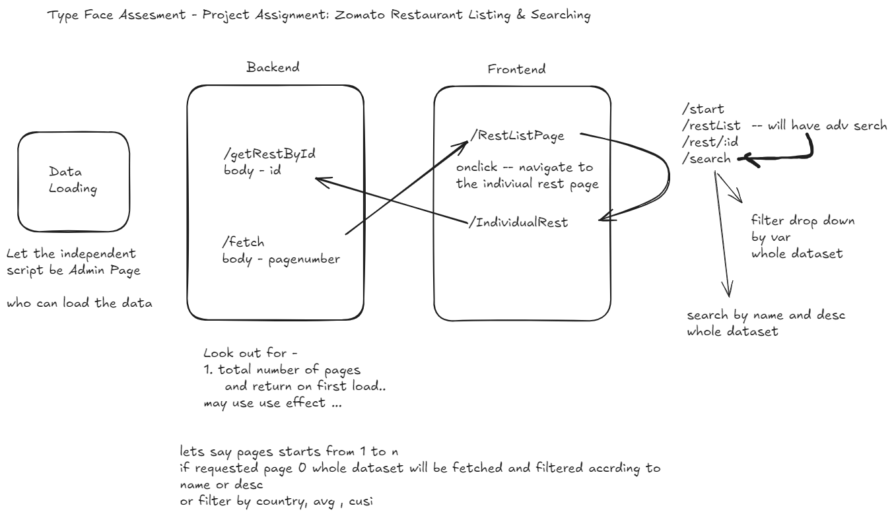
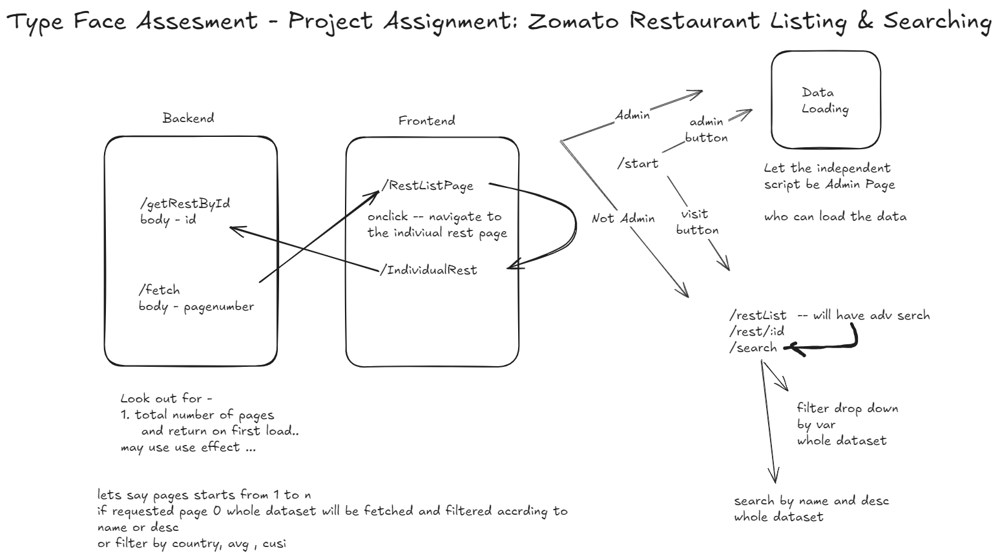
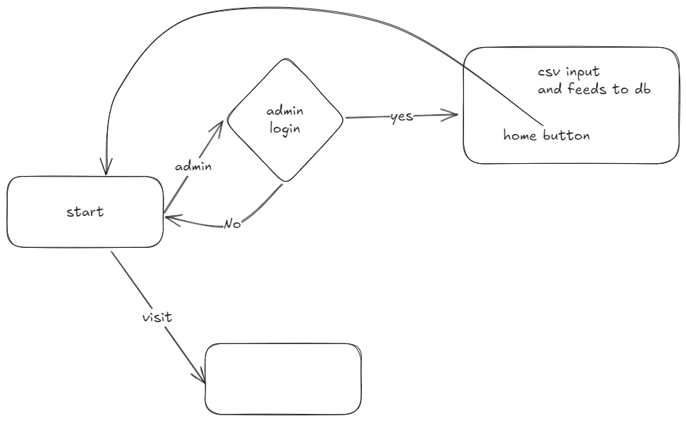
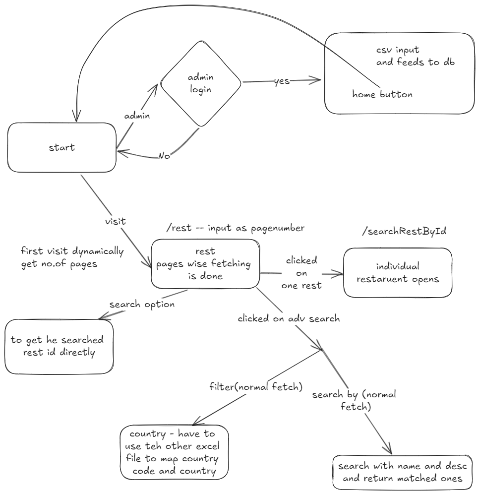

# Project Assignment: Zomato Restaurant Listing & Searching

## Key Use Cases

### Data Loading

Create an independent script to load the Zomato restaurant data available [here](./utilities/https://www.kaggle.com/datasets/shrutimehta/zomato-restaurants-data) into a database.

### Web API Service

Develop a web API service with the following endpoints to serve the content loaded in the previous step:

- **Get Restaurant by ID**: Retrieve details of a specific restaurant by its ID.
- **Get List of Restaurants**: Fetch a list of restaurants with pagination support.

### User Interface

Develop a web application with the following pages, which must connect to the web API service:

- **Restaurant List Page**: Display a list of restaurants. Clicking on a restaurant should navigate the user to the restaurant's detail page.
- **Restaurant Detail Page**: Show details of a specific restaurant.

## Additional Use Cases (Optional)

If time allows, implement the following additional features, ensuring they are supported in both the API and the UI:

- **Filtering Options**:
  - By Country
  - By Average Spend for Two People
  - By Cuisines
- **Search Functionality**: Enable search for restaurants by name and description.

--------------------- implementation -----------------------

1. Opened the assesment and read the README file
2. found that -- we need some independet script or method to load data.

1.1 we need backend ( need end points)
--- get restaurant by id
--- get list of restaurants
---- pagination support ( if there are 1000 restaurants in the database, instead of fetching all 1000 at once, the system might fetch only 10 restaurants per page. The user can then navigate to the next page to fetch the next 10 restaurants, and so on. )

1.2 we need frontend (to connect with backend/api)
--- page to display the rest list -- cliking on should lead the user to the page of the restaurant's detail page
--- need to figure out -- where can i get that details page-- hopefully from data set (figured out - think i should be needed to write a template for that)
--- Rest detail page -- shows details of specific rest

3. --- Additional

3.1. filtering

- By Country
- By Average 2 People
- By Cuisines( style of cooking )

  3.2. search functionality

- by name and description

-------------- break point --------------

Downloaded dataset
details of dataset
zomato.csv
21 cols
almost 1k rows

---

## country code - guess not use full for now

6 json files
-- guess the dataset provider filterd the json files and created the csv -- stopping exploring json files

---

## zomato.csv

Restaurant Id: pk
Restaurant Name
Country Code
City
Address
Locality

Locality Verbose: Detailed description of the locality

Longitude: Longitude coordinate of the restaurant's location

Latitude: Latitude coordinate of the restaurant's location

Cuisines: Cuisines offered by the restaurant

Average Cost for two

Currency
Has Table booking: yes/no
Has Online delivery: yes/no
Is delivering: yes/no

Switch to order menu: yes/no
Price range: range of price of food
Aggregate Rating: Average rating out of 5
Rating color: depending upon the average rating color
Rating text: text on the basis of rating of rating
Votes: Number of ratings casted by people

## 

## 

---

deciding on main flow -- and will be starting with backend

-------------- break point --------------
backend

starting with admin

npm init -y
npm i express nodemon
npm i dotenv
//to store env variables

package.json

"type": "module",

"scripts": {
"start": "nodemon index.js"
}

npm i bodyparser
//bodyparser.json() -- make reques and responses in json format

created the file system
config
controller
model
routes

created the connection between localhost as db mongo

created model, controller admin
created model for admin and setup so that admin will be created if not there

npm i multer
npm i csv-parser

created model, controller, routes for restaurant
created uploadcsv for the db insertion of data
used multer, fs, csv-parser for the upload

testing with postman
got error regarding the cusines
removed required=true
so then it worked and the data is inserted

---

implementing the visit side of the code

--
restbyid -- completed used param for that

little study about multer--
middleware for handling mullipart uploads
multer.diskStorage({dest},{filename})
cb- callbackfunction
cb(null(no error),path/filename)

---

implemented getRest - pagination

Rest.find() -- fetches all the docs
.skip(number) -- skips number of collections
.limit(numnber)--after skip no.of docs should be considered
.then(after promise is completed we will send the data)

---

updated a endpoint to get total number of pages
docs/perpage

---

updated the search using regex

if (name) {
query["Restaurant Name"] = { $regex: name, $options: "i" }; //option i means to serach case insensitive
}

if (description) {
query.$or = [
{ "Restaurant Name": { $regex: description, $options: "i" } },
{ "Locality Verbose": { $regex: description, $options: "i" } },
{ Cuisines: { $regex: description, $options: "i" } },
]; // checks if desc provided matches with name or localilty or cuisines etc..,
}
const restaurants = await Restaurant.find(query);

// we will use same template to display where the data is provded
// changed some changes for totalnoofpages and the data which is shown dynamic

---

end point for the search filter
using regex
we will do the same after filtering we will give data to the frontend template with pagation

---

updated endpoint for adminlogin
and tested using post man

---

-------------break point-----------------

started with making admin page at the frontend
created basic login form at frontend
succesful login will lead to uploading of the data to the database

---

connected to thebacked api of admin login to frontend
backend needs -- cors
npm i cors Cross-Origin Resource Sharing (CORS)
and also implemented env in fronend
REACT*APP*

---

implemented after login logic for admin
task 1 - completed
of uplading data from external script here admin

---

getting to restaurent flow --
first implemented code for Restarant.jsx
which is inital page so without any changes we will fetch the data and assign page numberand deipsly is done

-- as we should be using the display component of this restaraunt page we must use a template
create a template which takes parameters of data no.of pages and function to handle the page change
according to the datta fetched we will using the content..
--- might have to change the get requests to post to take the data from body later
-- for now restaurants areupdated accodring to the page number

---

using params and get methods creadted indiviudal page with the useparms
and rendered the data in ind rest

---

implemented th Ind-rest component which fetches the individual restaurant and displays its content
use ccmapper -contury code mapper and got the countryname

---

coming to advanded search -- implemented more options first
search by country and cousines and cost
check with postman

---
